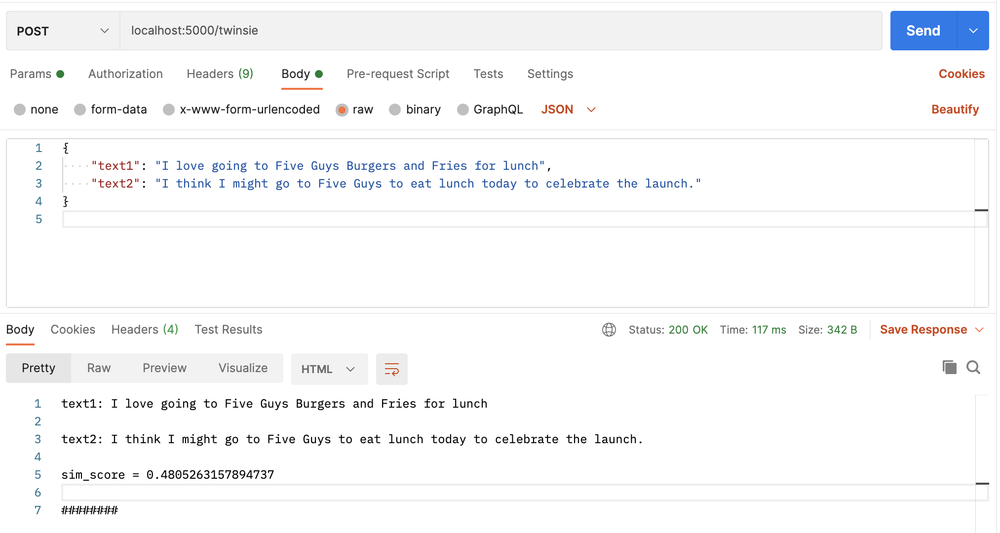

[]()
[]()

# twinsie!

A minimal service that measures similarity between two pieces of text producing a score from 0 to 1.

The overall score ranges from 0 (not similar at all) to 1 (perfectly
similar, or exactly the same). Twinsie uses three methods to determine
this score. First, it looks at common words in comparison to all of the words.
This is similar to the Jaccard distance calculation. This is the most basic 
of the three methods and can be a poor similarity method on its own. 
    
To mitigate that, and add more precision, method two attempts to take all 
of the uncommon words between the two strings and see if we can fuzzy match 
them against each other. Any fuzzy matches are accounted for and factored 
into the overall score. 
    
Lastly, we look at the order of the words to add even more precision to the 
final score. We take all of the common words and evaluate their position in
one text string in relation to its position in the other text string. If it
exist within the bounds of a pre-defined window, we consider that a "match"
and that is factored into the final score.


## Getting started

Install [docker](https://docs.docker.com/engine/installation/) and run the following from within this directory (after cloning the repo):

```shell
docker-compose up --build
# docker-compose stop
```

Otherwise, for the standalone web service:

```shell
pip install -r requirements.txt
python app.py
```

Visit [http://localhost:5000](http://localhost:5000) to see the Home Page.

There you will see instructions to send a POST request containing your two strings in the body of a JSON blob to the `/twinsie` endpoint. You will want to label them *text1* and *text2*.

`http://localhost:5000/twinsie`


### Sample Payload

```
{
    "text1": "I love going to Five Guys Burgers and Fries for lunch",
    "text2": "I think I might go to Five Guys to eat lunch today to celebrate the launch."
}
```
Response:
```
text1: I love going to Five Guys Burgers and Fries for lunch

text2: I think I might go to Five Guys to eat lunch today to celebrate the launch.

sim_score = 0.4805263157894737

########
```


### Sample Call from Command Line with `cURL`

```shell
curl --data '{"text1": "I love going to Five Guys Burgers and Fries for lunch", "text2": "I think I might go to Five Guys to eat lunch today to celebrate the launch."}' http://localhost:5000/twinsie --header 'Content-Type: application/json' --header 'Accept: application/json'
```

Response:
```
text1: I love going to Five Guys Burgers and Fries for lunch

text2: I think I might go to Five Guys to eat lunch today to celebrate the launch.

sim_score = 0.4805263157894737

########
```

### Sample call from [Postman](https://www.postman.com/downloads/)



## Development

Create a new branch off the **development** branch for features or fixes.

After making changes rebuild images and run the app:

```shell
docker-compose build
docker-compose run -p 5000:5000 web python app.py
```

### Summarized Output with Verbose

Additional Note:
Setting the `self.verbose` instance variable in the `Twinsie` module will unlock the "under the hood" summary of the score calculations.

This can be helpful during local development and when making decisions about how to tweak and tune the various tolerance windows and thresholds for more accuracy (based on the common characteristics of the data you'll push to it).

#### Sample Payload with Summary 
##### `verbose` = True
```
text1: I love going to Five Guys Burgers and Fries for lunch

text2: I think I might go to Five Guys to eat lunch today to celebrate the launch.

sim_score = 0.4805263157894737

########

fuzzy_score(target = five, source = fries) = 0.5
fuzzy_score(target = go, source = going) = 0.5
fuzzy_score(target = lunch, source = launch) = 0.8333333333333334
fuzzy_score(target = going, source = go) = 0.5
fuzzy_match_count = 4
fuzzy_match_count/self.all_words = 0.21052631578947367
remainder = 0.736842105263158
position matches for i
position matches for lunch
str1_pos_dict = {'i': [0], 'love': [1], 'going': [2], 'to': [3], 'five': [4], 'guys': [5], 'burgers': [6], 'and': [7],
'fries': [8], 'for': [9], 'lunch': [10]}
str2_pos_dict = {'i': [0, 2], 'think': [1], 'might': [3], 'go': [4], 'to': [5, 8, 12], 'five': [6], 'guys': [7], 'eat':
[9], 'lunch': [10], 'today': [11], 'celebrate': [13], 'the': [14], 'launch': [15]}
pos_matches total = 2
pos_counter total = 16.0
pos_score = 0.125
remainder = 0.5894736842105264
```


